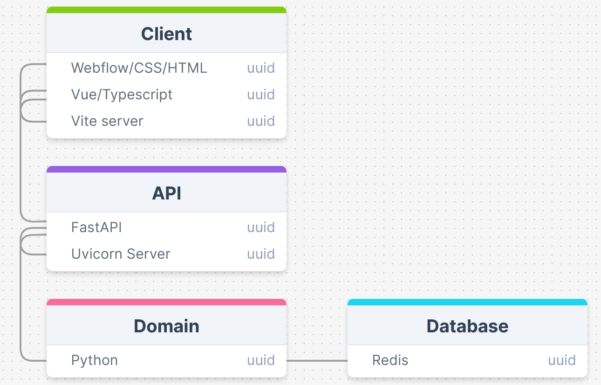
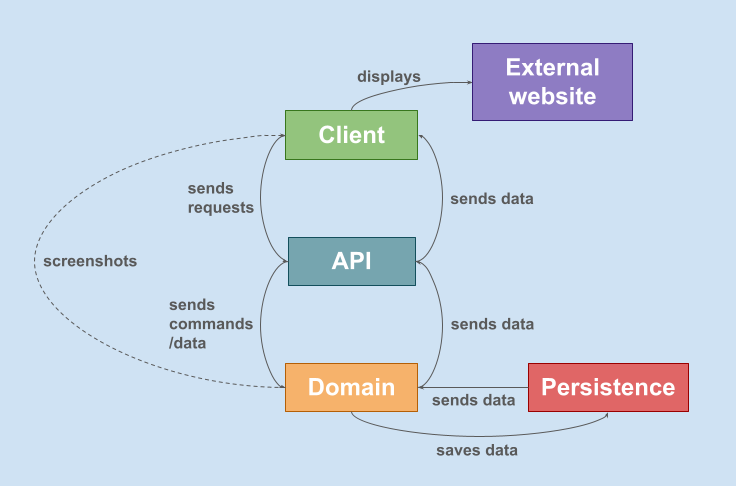

# Personal IP

CI/CD status:

[](https://git.sogyo.nl/rkeijzer/personal-ip/-/commits/main)

[](https://git.sogyo.nl/rkeijzer/personal-ip/-/commits/main)


## Dependencies
### Client
Install dependencies:
```
cd client
npm install
```
### Domain
Install libraries:

```
pip install Pillow
pip install numpy
pip install mss
pip install pywin32
pip install redis
pip install pytesseract
```
install FastAPI and Uvicorn:
```
pip install fastapi
```
Make sure to install to the correct path. If installed to an alternative path make sure to add this path to the windows environment variables (system and user)
***

## Build Commands
### Client
Run the Vite server:
```
cd client
npm run dev
```
### Domain
Run the Uvicorn server:
```
uvicorn domain.api.main:app --reload
```
***

## Project Goals
The goal of the project is to create a gameplay bot, specifically for the game Flappy Bird.
***

## MoSCoW
#### Must Have
- Game to autoplay
- Way to get game output
- Way to give game input
- autoplay logic for the specific game
#### Should Have
- website to play on with embedded game
#### Could Have
- Bot auto trainer
- Database to store training data or highscores
#### Won't Have
- Advanced machine learning
- AI integration
***

## Software Stack
### Frontend
- Language: TypeScript
- Server: Vite
- Typescript framework: Vue
- Design tool: Webflow + HTML/CSS
### Backend
- Language: Python
- Server: Uvicorn
- API framework: FastAPI
- Unit testing: Pytest
- CI: Gitlab CI
- Database: Redis
***

## Project Structure
<!--  -->
<!--  -->


## Personal Learning Goals
- Keeping track of issues and planning using the issue board in Gitlab
- Defining a proper scope for the project, not too big, not too small
***

## Technical Learning Goals
- Coding in Python
- Pytest set-up
- FastAPI set-up and usage
- Redis set-up and usage
- Vite set-up
- Vue usage
- Webflow usage
***

## Resources
- [Vite: Get started](https://vitejs.dev/guide/)
- [FastAPI: Installation](https://fastapi.tiangolo.com/#installation)
- [Webflow](https://webflow.com)
- [Pytest: Get started](https://docs.pytest.org/en/8.2.x/getting-started.html)
- [Redis: Install on windows](https://redis.io/docs/latest/operate/oss_and_stack/install/install-redis/install-redis-on-windows/)
***